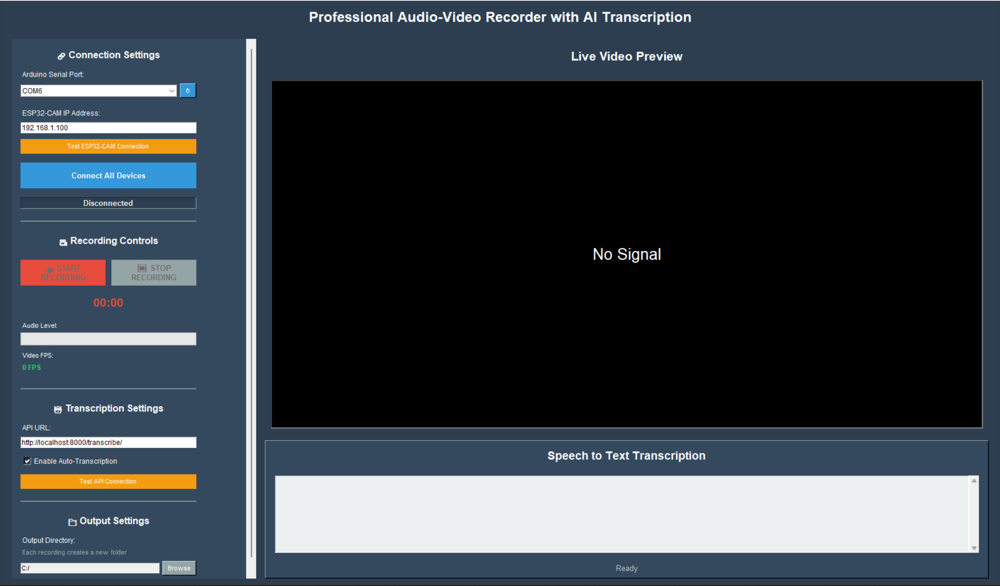

# Professional Audio-Video Recorder with AI Transcription



A complete IoT solution for synchronized audio-video recording with real-time speech-to-text transcription using Arduino, ESP32-CAM, and Python.

## Demo Video

[⬇️ Download Video](https://github.com/msmahdinejad/AI-Powered-IoT-Recording-System/raw/refs/heads/main/Doc/Video/Test.mp4)

## Features

- **High-Quality Audio Recording** - 16kHz sampling with MAX9814 amplifier
- **Real-Time Video Streaming** - VGA resolution at 25fps via ESP32-CAM
- **Precise A/V Synchronization** - ±10ms accuracy with hybrid sync algorithm
- **AI-Powered Transcription** - Integrated Vosk speech recognition
- **Smart File Management** - Organized folder structure with metadata
- **Professional GUI** - Intuitive interface with real-time monitoring
- **Low Cost** - 70% cheaper than commercial alternatives
- **Offline Capable** - Works without internet connection

## System Requirements

### Hardware
- Arduino Nano/Uno
- ESP32-CAM Module
- MAX9814 Microphone Module
- USB Cable for Arduino
- 5V Power Supply for ESP32-CAM
- WiFi Network

### Software
- Python 3.9+
- Arduino IDE 1.8+
- FFmpeg
- Windows/macOS/Linux

## Installation

### 1. Clone Repository
```bash
git clone https://github.com/msmahdinejad/audio-video-recorder.git
cd AI-Powered-IoT-Recording-System
```

### 2. Install Python Dependencies
```bash
pip install -r requirements.txt
```

### 3. Setup Hardware

#### Arduino Setup
1. Open Arduino IDE
2. Install TimerOne library
3. Upload `arduino.ino` to Arduino Nano

#### ESP32-CAM Setup
1. Add ESP32 board support to Arduino IDE
2. Update WiFi credentials in `esp32_cam.ino`
3. Upload code to ESP32-CAM module

### 4. Setup Transcription API (Optional)

#### Install Vosk Dependencies
```bash
pip install vosk fastapi uvicorn
```

#### Install FFmpeg
**Windows:**
```bash
# Download from https://ffmpeg.org/download.html
# Or use chocolatey:
choco install ffmpeg
```

**macOS:**
```bash
brew install ffmpeg
```

**Linux:**
```bash
sudo apt update
sudo apt install ffmpeg
```

#### Download Vosk Model
```bash
# Create models directory
mkdir models
cd models

# Download English model (40MB)
wget https://alphacephei.com/vosk/models/vosk-model-small-en-us-0.15.zip
unzip vosk-model-small-en-us-0.15.zip

# For Persian support (optional)
wget https://alphacephei.com/vosk/models/vosk-model-fa-0.5.zip
unzip vosk-model-fa-0.5.zip
```

#### Start Transcription Server
```bash
# Method 1: Direct run
python transcription_api.py

# Method 2: Using uvicorn
uvicorn transcription_api:app --reload --host 0.0.0.0 --port 8000

# Method 3: If uvicorn not recognized (Windows)
python -m uvicorn transcription_api:app --reload --host 0.0.0.0 --port 8000
```

#### Verify API Server
Open browser and go to: `http://localhost:8000/docs`

You should see the FastAPI documentation interface.

### 5. Run Application
```bash
python record.py
```

## Usage

### Device Connection
1. Connect Arduino via USB
2. Power ESP32-CAM and note IP address
3. Launch application
4. Select Arduino port from dropdown
5. Enter ESP32-CAM IP address
6. Click "Connect All Devices"

### Recording
1. Monitor audio levels and video preview
2. Click "START RECORDING"
3. Record your content
4. Click "STOP RECORDING"
5. Wait for processing to complete

### Output Files
```
recordings/
└── recording_20241201_143022/
    ├── audio/
    │   └── audio_20241201_143022.wav
    ├── video/
    │   └── video_20241201_143022.avi
    ├── final/
    │   └── recording_20241201_143022.mp4
    └── transcript_20241201_143022.txt
```

## Configuration

### Audio Settings
```python
SAMPLE_RATE = 16000        # Audio sample rate (Hz)
CHANNELS = 1               # Mono recording
BIT_DEPTH = 8             # 8-bit samples
```

### Video Settings
```cpp
config.frame_size = FRAMESIZE_VGA;    // 640x480 resolution
config.jpeg_quality = 12;             // Quality (0-63, lower = better)
config.fb_count = 2;                  // Frame buffers
```

### Synchronization Tuning
```python
audio_latency_compensation = 0.030    # 30ms audio advance
video_latency_compensation = 0.050    # 50ms video advance
ffmpeg_fine_tune = 0.020             # Final adjustment
```

## Hardware Connections

### Arduino Connections
```
MAX9814 Module:
- VCC → Arduino 5V
- GND → Arduino GND
- OUT → Arduino A0
```

### ESP32-CAM Setup
```
ESP32-CAM Module:
- Connect camera module
- 5V power supply
- WiFi network access
```

### Dependencies
- **OpenCV** - Video processing
- **pySerial** - Arduino communication
- **tkinter** - GUI framework
- **numpy** - Numerical processing
- **requests** - API communication
- **Vosk** - Speech recognition (optional)
- **FastAPI** - Transcription API server (optional)
- **uvicorn** - ASGI server (optional)
- **FFmpeg** - Audio/video encoding
